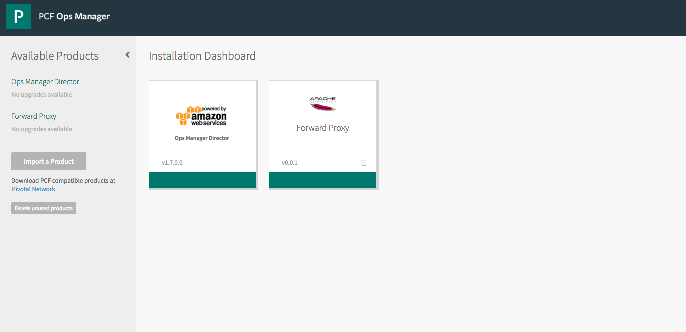
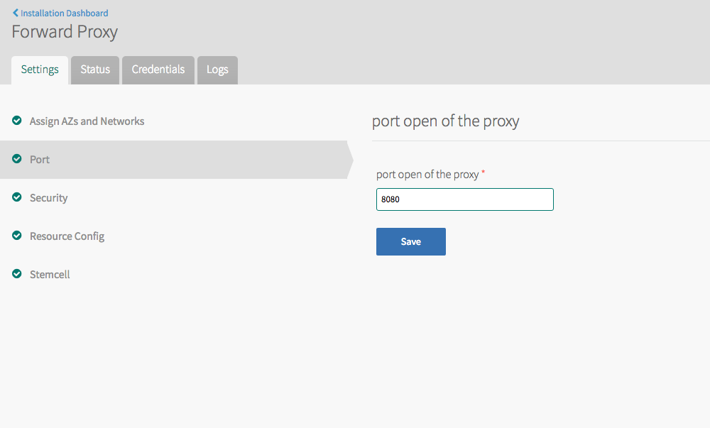
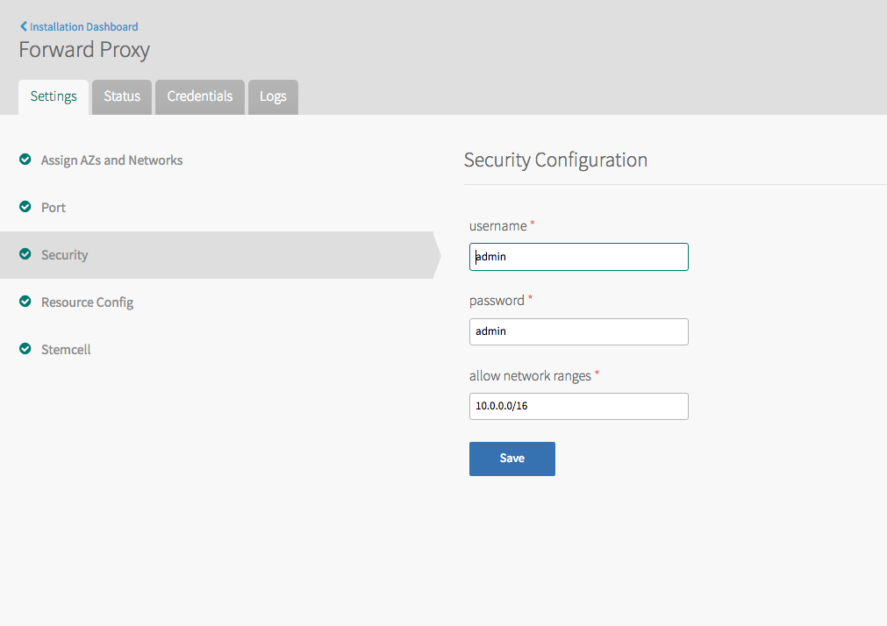

* Usage
This tile can be used to deploy a http proxy by Ops Manager

* [Apache forward proxy bosh release](https://github.com/datianshi/apache-forward-proxy-boshrelease)

* Configuration

  * Configure the open port

    

  * Configure the security

    

    Proxy basic authentication with username and password

    Comma delimited network ranges that allowed in this proxy

* Example of usage of this proxy

```
curl www.google.com --proxy http://admin:admin@[proxy_ip]:8080
```    

* How to build this tile

```
gem install vara
vara build-metadata .
```     

* Todo

Make this proxy to use another remote proxy
